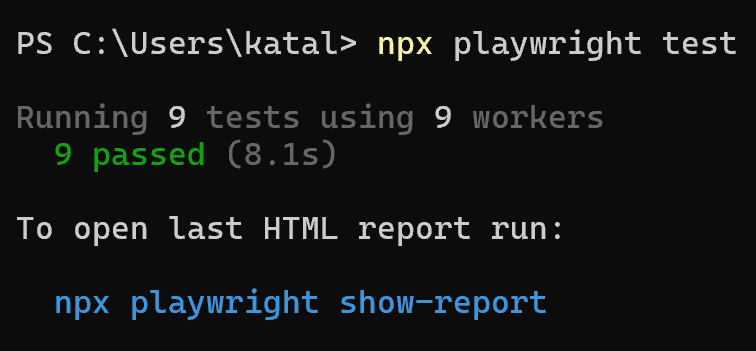

# BookCart E2E Automation

End-to-end automated testing project for the BookCart online bookstore using Playwright and TypeScript.

This project is based on the Roadmap.sh QA Automation project:

https://roadmap.sh/projects/e2e-test-ecommerce-app

## Project Goal

The goal of this project is to gain hands-on experience in QA Automation by implementing automated UI tests for critical user workflows in an e-commerce application.

The project covers:

* User Registration
* User Login
* Search Field Validation
* Cross-browser testing
* Git and GitHub workflow
* Test execution using Playwright

---

## Technologies

* Playwright
* TypeScript
* Git
* GitHub
* GitHub Actions

---

## Supported Browsers

* Chromium
* Firefox
* WebKit

---

## Implemented Tests

### User Registration

The test verifies that a new user can successfully register in the application.

**Test flow:**

1. Open BookCart website
2. Open Login page
3. Navigate to Registration page
4. Generate a unique username
5. Fill the registration form
6. Submit registration
7. Verify successful registration through backend response validation

---

### User Login

The test verifies that an existing user can successfully log in.

**Test flow:**

1. Open BookCart website
2. Open Login page
3. Enter valid credentials
4. Submit login form
5. Verify successful authentication

---

### Search Field Validation

The test verifies that the search field accepts user input correctly.

**Test flow:**

1. Open BookCart website
2. Enter text into the search field
3. Verify that the entered value is displayed correctly

---

## Test Execution

Run all tests:

```bash
npx playwright test
```

Run a specific test file:

```bash
npx playwright test tests/auth.spec.ts
```

Open the Playwright HTML report:

```bash
npx playwright show-report
```

---

## Test Results

Current project status:

* User Registration ✅
* User Login ✅
* Search Field Validation ✅

All implemented tests successfully pass in:

* Chromium
* Firefox
* WebKit

Example result:

```text
9 passed (8.1s)
```

## Test Execution Example



---

## Known Issue

The live BookCart demo environment currently contains a backend defect.

The endpoint:

```http
GET /api/Book
```

returns:

```http
500 Internal Server Error
```

As a result:

* Product catalog is unavailable
* Shopping Cart scenarios cannot be tested
* Checkout scenarios cannot be tested

The issue has already been reported in the original BookCart GitHub repository:

**Issue #47 – Error 500 Books**

Because of this blocker, the project currently focuses on the application areas that remain fully testable.

---

## Repository Structure

```text
tests/
├── auth.spec.ts
│   ├── User Registration
│   └── User Login
│
└── search.spec.ts
    └── Search Field Validation

screenshots/
└── all-tests-passed.png
```

---

## Learning Outcomes

Through this project I gained practical experience with:

* UI Test Automation
* Playwright Locators
* Assertions
* Cross-browser Testing
* Git Version Control
* GitHub Workflow
* API Investigation using Swagger
* Bug Analysis and Defect Verification
* Test Documentation
